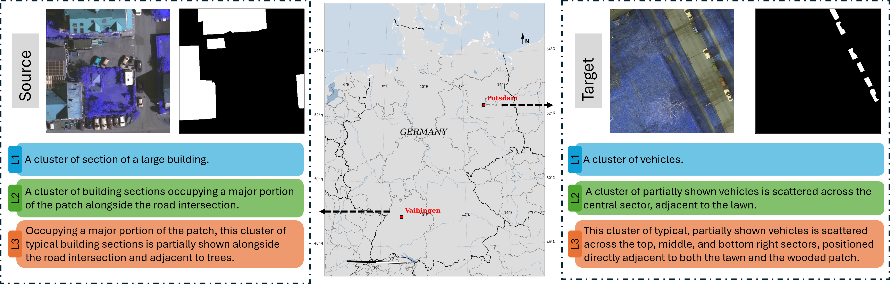

# VPRef: A Cross-Domain Benchmark for Referring Remote Sensing Image Segmentation

We introduce a cross-domain referring remote sensing image segmentation task, construct the first benchmark dataset (VPRef), and propose a simple yet effective baseline (SAM3-ft).

[Dataset](https://drive.google.com/drive/folders/1shQOuGhQwtvq_Q8WEKtg1-J5NeJ9nWyX?usp=sharing) 

 
<!-- <em>Rapid advancements in vision-language models have propelled Referring Remote Sensing Image Segmentation (RRSIS) to the forefront of Earth observation. However, practical deployments suffer severe performance degradation under a coupled dual-drift paradigm: visual domain drift from cross-spatial-resolution mismatches and spectral variations, alongside textual logic drift from unconstrained, variable user-input granularities. To mitigate these bottlenecks, this paper establishes the first cross-domain RRSIS benchmark, designated as the Vaihingen-Potsdam Referring (VPRef) dataset, comprising 46,972 language-image-annotation triplets organized into a three-tier linguistic hierarchy. Building upon this benchmark, we develop a tailored parameter-efficient domain adaptation baseline anchored on the Segment Anything Model (SAM3) via Low-Rank Adaptation (LoRA). Our framework counteracts visual distribution discrepancies through pseudo-label-driven self-training and addresses textual logic drift via random multi-granularity text prompt mixing. Crucially, the distribution of empirical metrics across ablative variants suggests a potential decoupling between cross-modal semantic robustification and visual domain alignment, demonstrating that linguistic variance drives fine-grained semantic invariance while pseudo-label propagation governs macro-scale spatial grid alignment. Extensive benchmarks demonstrate the proposed framework achieves superior cross-domain segmentation boundaries while modifying merely 1.08% of the foundational parameter footprint, establishing a robust baseline for future multi-modal remote sensing domain adaptation research.</em> -->

### Friend links:
- If you are interested in hyperspectral image classification, pixel-based classification, or information fusion, feel free to refer to [PatchwiseClsFra](https://github.com/quanweiliu/PatchwiseClsFra).
- If you are interested in image semantic segmentation or information fusion, feel free to refer to [TilewiseSegFra](https://github.com/quanweiliu/TilewiseSegFra).
- If you are interested in referring image semantic segmentation, feel free to refer to [ReferringSegFra](https://github.com/quanweiliu/ReferringSegFra).
- This repository is inspired by [SAM3](https://github.com/facebookresearch/sam3) and [SAM3_LoRA](https://github.com/Sompote/SAM3_LoRA).
